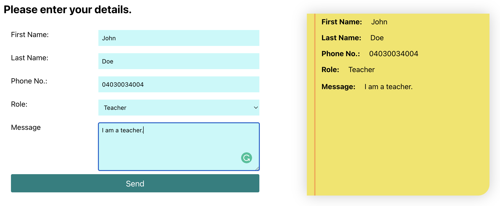
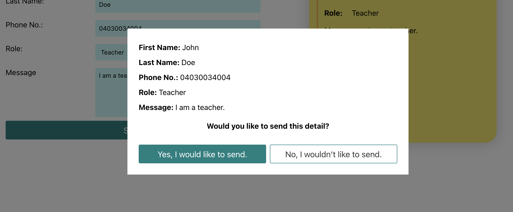

# Form App made in React

## This is an assignment for Fullstack Web Developer Program in REACT & NODE at BCH, 2022.

This form takes multiple inputs for example, first name, last name and phone number into account. Data which are inserted are shown on the sticker-note at the right hand side, right-away. Upon clicking "Send" button, a pop-up opens to verify whether data are to be sent or not.

PS: The design and functionalities of the app might be different than screenshots in future as, application is a subject to constant upgrade.

#### Screenshot 1

#### Screenshot 2

